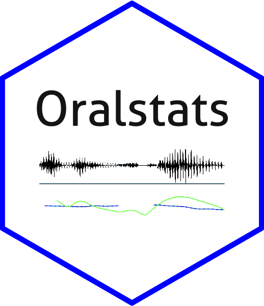

[](https://zenodo.org/badge/latestdoi/408316659)

# Oralstats v1.8 — LASP (Laboratorio de Análisis de la Señal Prosódica)

Oralstats is a data-exploratory tool for transcribed speech: it joins transcriptions with pitch and intensity data and lets you **visualize, model and explore prosody** at discourse level. Version **1.8** is a complete modernization that keeps the original SQL/Shiny exploratory spirit but rebuilds the interface with `bslib` and delegates the heavy signal and language processing to a **Python pipeline** (Praat/Parselmouth extraction, UDPipe, `pysentimiento` and emotion2vec+). Everything is organized around a single top navigation bar, with a corpus summary (files, speakers, intonational groups, phonic groups, words, vowels) always one click away.

Developed by Adrián Cabedo Nebot ([adrian.cabedo@uv.es](mailto:adrian.cabedo@uv.es)), associate professor at the Universitat de València (Spain).

> 📦 **Looking for older releases (≤ v1.3)?** The classic `oralstats.view` / `oralstats.creation` modules, the intro video, the older demos and the project *mods* now live in **[LEGACY.md](LEGACY.md)**.

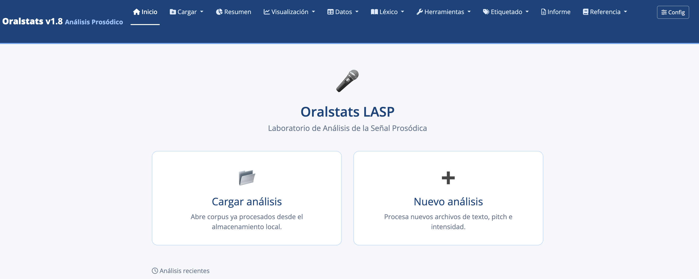

# Installation

The modernized version lives in [`last_version/`](last_version/) and is designed to install itself on first run. You only need **R** and an editor (**Positron** or **RStudio**); the launcher `run.R` takes care of R packages and the whole Python environment — **you never touch `pip` or `conda` yourself**.

## Quick start (recommended)

1. Install **R** (<https://cran.r-project.org>) and **Positron** (<https://positron.posit.co>) or RStudio. Standard double-click installers.
2. In your editor, open the **`last_version/`** folder as a project (`File > Open Folder…`). This folder contains `run.R` and `app.R`.
3. Open **`run.R`** and press **Source** (RStudio/Positron), or from a terminal run:
   ```bash
   Rscript run.R
   ```
4. **Wait.** The first run downloads and installs everything automatically (R packages, a Python virtual environment and the core acoustic dependencies). It can take several minutes; afterwards the app opens in your browser. Later launches are fast.

You need an Internet connection on the first run. No manual Python/conda setup is required.

## What `run.R` does

`run.R` is a single launcher that reproduces the environment and starts the app:

1. **Ensures the R packages** (via `R/ensure_r_packages.R`) — installs any missing ones from CRAN as binaries.
2. **Bootstraps a Python environment** (via `R/portability.R` + `R/setup_python.R`): it creates a native-architecture virtualenv `oralstats-env` (Python 3.10–3.12, managed through `reticulate`) and installs the **core** dependency level. If no suitable Python is found, `reticulate` installs one automatically.
3. **Launches the Shiny app** (`app.R`) in your browser.

## Python dependencies (installed by levels)

To keep startup light, the Python pipeline installs in tiers — only the core tier is installed at launch; the heavier ones are large downloads that you install **on demand** from the app's **"Dependencias Python"** tab:

| Level | Installed | Packages | Used for |
|---|---|---|---|
| **core** | at startup (`run.R`) | `praat-parselmouth`, `tgt` | pitch/intensity/text extraction |
| **text** | on demand (tab, level 2) | `pysentimiento`, `funasr`, `soundfile` | textual sentiment + acoustic emotion (emotion2vec+) |
| **asr** | on demand (tab, level 3) | `whisperx`, `pyannote.audio` | transcription / diarization |

Useful overrides (optional environment variables):

- `ORALSTATS_PY_LEVEL` — startup level for `run.R` (default `core`; e.g. set `text` to also install the sentiment/emotion tier at launch).
- `ORALSTATS_PYTHON` — path to a specific Python 3.10–3.12 interpreter to use instead of the auto-detected one.

## Requirements

- **R** ≥ 3.6 (a current version is recommended) and a modern browser (Chrome/Safari).
- **Positron** or **RStudio** 1.4.1717 or later.
- **Python 3.10–3.12**, native architecture — auto-installed if not present.
- Internet access on the first run.

**R packages (v1.8)** — installed automatically by `run.R`:

> av; bslib; data.table; dplyr; DT; ggeffects; ggfun; ggplot2; jsonlite; mgcv; plotly; RColorBrewer; reticulate; seewave; shiny; shinyjs; tidyr; tuneR; udpipe

**Note:** UDPipe needs a language model file; a Spanish file ships by default, but you can use any other language file covering your needs.

# What you can do

The app is organized around a single top navigation bar. The main capabilities are:

## Load and summarize a corpus
Open already-processed corpora from local storage or process new material from scratch: TextGrid + WAV pairs are turned into the tabular text/pitch/intensity files the app expects, using the bundled Praat and Parselmouth scripts. The **Summary** view condenses the whole corpus into KPI cards and a breakdown by discourse genre, file or speaker.

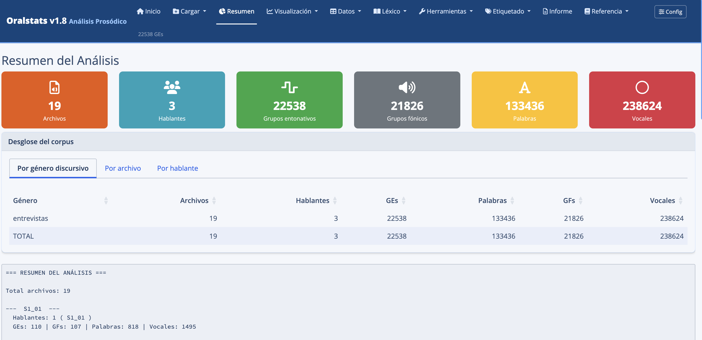

## Navigate and visualize intonation
Browse intonational groups (GE) one by one, listen to them, and read their automatic descriptors —AMH (*análisis melódico del habla*) label and nuclear ToBI tag among them. Each group can be plotted as normalized values, raw Hz, semitones (ggplot2) or as a Praatpicture-style figure, and the projection can be customized (pitch, intensity, vocalic transition, tonal peaks, tonic marks, ToBI tags, internal A/C/T sections…).

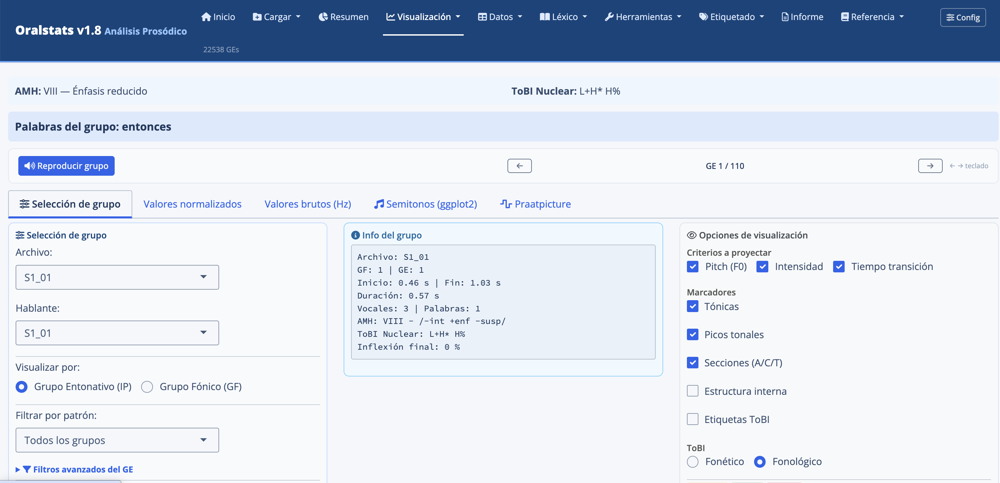

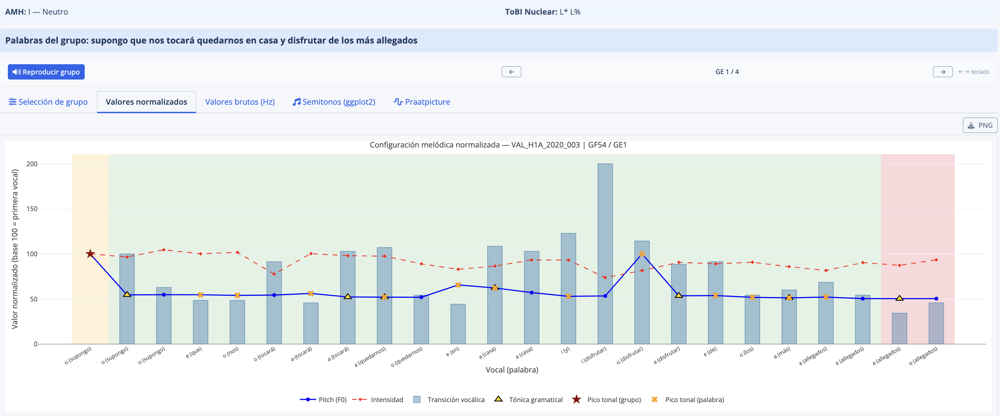

The **temporal evolution** view tracks any numeric variable (e.g. mean intensity) along the timeline, file by file and speaker by speaker.

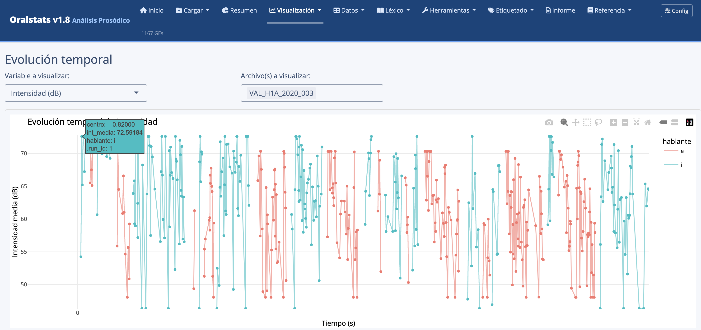

A dedicated module detects **intonational clauses** following the *Corolario de Hidalgo Navarro* (recursion, hierarchy and declination diagnostics) and plots the F0 trajectory of every detected clause.


## Explore the data tables
All intonational and phonic groups are available as sortable, searchable and column-filterable tables (filename, speaker, phonic group, intonational group, onset/offset, duration, number of vowels and words, speech rate, F0 values…), ready to be inspected or exported.

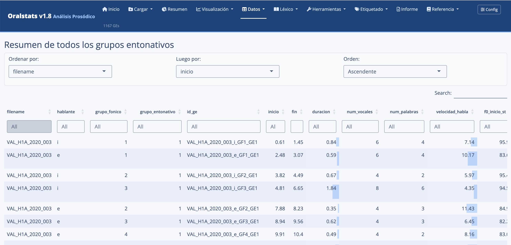

## Analyze the lexicon
The **Léxico** menu offers word-frequency and lexical-diversity analysis (type/token ratio, surface form or UDPipe lemma, with optional stopword removal), bigrams and trigrams with configurable *N*, and word clouds.

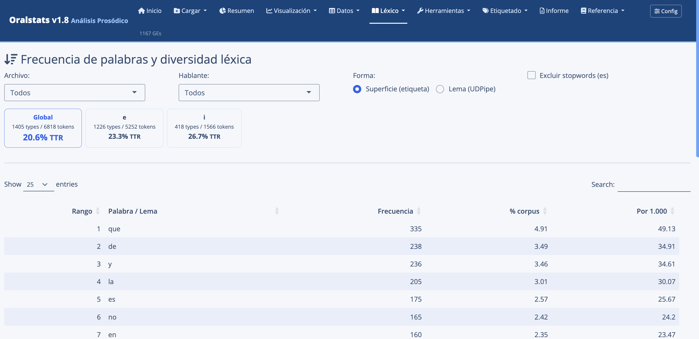

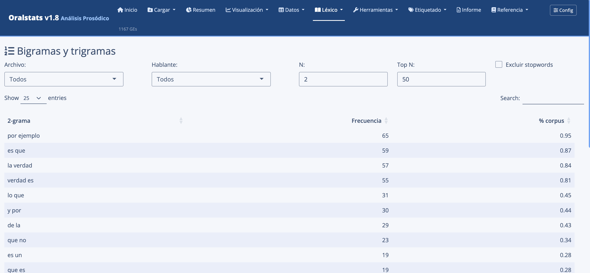


## Tag sentiment and emotion
Combine **textual sentiment** (`pysentimiento`) with **acoustic emotions** (emotion2vec+) to obtain sentiment and emotion distributions and their relationship. The same module lets you tag each intonational group manually with a perceived emotion (Ekman emojis) while looking at its melodic curve.

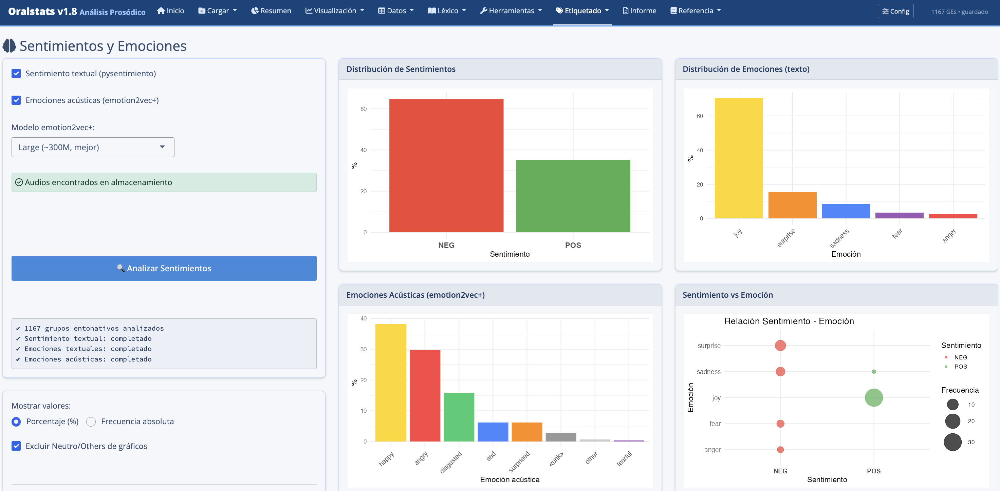


To assess reliability, the **judge validation** module builds perception tasks where one or more judges listen to balanced samples of intonational groups and rate the perceived emotion and its intensity.

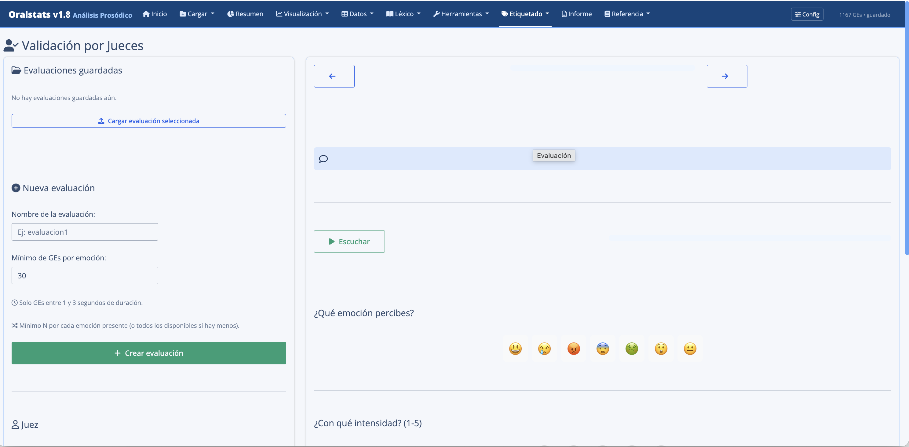

## Generate prosodic reports
A guided **report generator** turns the corpus into a full prosodic report: choose the dataset and filters (validated items only, outlier removal by percentiles/Z-scores, grouping), pick the numeric variables, and select the sections to include —descriptive statistics, boxplots with significance tests, correlation heatmaps, ANOVA/Kruskal-Wallis, linear regression, random forest, decision trees, GAMM (Generalized Additive Mixed Models), extreme examples, melodic curves by pattern, Hidalgo Navarro clauses and more— before previewing and exporting it.

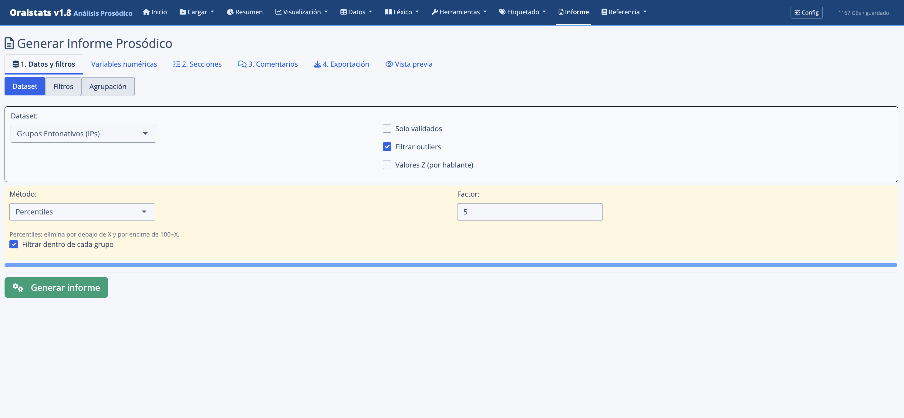

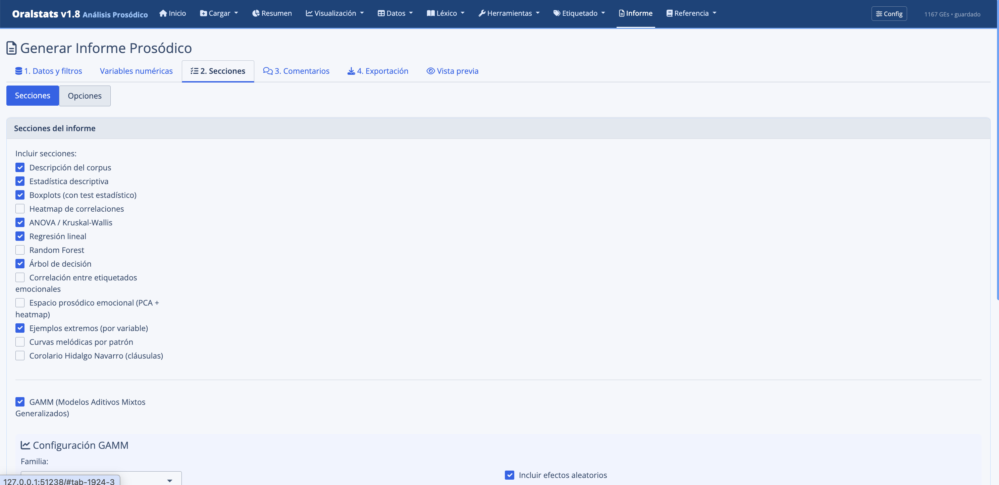

> **Files of the modernized version** live in [`last_version/`](last_version/): the Shiny app (`app.R`), the launcher (`run.R`), the Praat/Parselmouth extractors (`script_PRAAT_extraer_pitch_intensity_transcriptions.praat`, `python/extract_with_parselmouth.py`) and the sentiment/emotion analyzer (`python/analyze_sentiment_emotion.py`).

# How to cite

You can use the following citations to refer to this tool:

- Cabedo, A. (2021). Oralstats. A tool to visualize and explore transcriptions and phonic data. Version beta 1.0 <https://github.com/acabedo/oralstats>
- Cabedo, A. (2022). Oralstats. A tool to visualize and explore transcriptions and phonic data. Version beta 1.3 <https://github.com/acabedo/oralstats>
- Cabedo Nebot, A. (2022). Using Oralstats for prosodic characterisation of speakers in different discourse genres. Loquens, 8(1-2), e079. <https://doi.org/10.3989/loquens.2021.079>
- Cabedo Nebot, A. (2022). Visualizing melody with multiple acoustic and tagging values using the visualization module of the Oralstats tool. Estudios de Fonética Experimental, XXXI, 135-148. <https://www.ub.edu/journalofexperimentalphonetics/pdf-articles/XXXI-10-Cabedo.pdf>

# Docs

The docs section is **still under development**. For now, if you have a problem or question about Oralstats, you can send me an email ([adrian.cabedo@uv.es](mailto:adrian.cabedo@uv.es)).

# Funding

This new version of Oralstats (v1.8) has been funded by the project **PID2023-148371NB-C42** of the **Ministerio de Ciencia, Innovación y Universidades** (Spain).

> Earlier funded projects that supported previous versions of Oralstats are listed in [LEGACY.md](LEGACY.md#funding-earlier-versions).

# Credits

I must give special credit to *Radiant, Business analytics using R and Shiny* (Vnijs 2016). Although it is focused mainly on business data mining, this tool was for me a deeply inspirational idea: in my case, it developed the idea of analyzing data online/offline, using Shiny, in a dynamic mode, adding and/or filtering this data to observe linguistic patterns from speech transcriptions.

Other inspiration for me was all the work done by Davies the last twenty years (2005, 2016, 2020, among many others) on the construction of several linguistic corpora; specially, I got really interested about joining data with SQL instances. This is really a good approach to structured data, as it could be the one coming from oral linguistic data, in which phonemes relate to words and these last two relate to utterances and all of them relate to speakers and so on.

Finally, about the ideas that have been key to develop Oralstats, I want to express my gratitude to web platforms like Spokes (<http://pelcra.clarin-pl.eu/SpokesBNC/>) and to software tools like the ones developed by Laurence Anthony (<https://www.laurenceanthony.net/>). Also, it wouldn't have been possible to make speech and phonic analysis without the aid of tools like ELAN (<https://archive.mpi.nl/tla/elan>) and PRAAT (Boersma and Weenink, 2021, <https://www.fon.hum.uva.nl/praat/>).

# Caution

All errors and omissions (bad statistical operations [means, medians...], bad visualizations, etc.) remain the author's sole responsibility.

# License

GNU General Public License v3.0. Permissions of this strong copyleft license are conditioned on making available complete source code of licensed works and modifications, which include larger works using a licensed work, under the same license. Copyright and license notices must be preserved. Contributors provide an express grant of patent rights.
