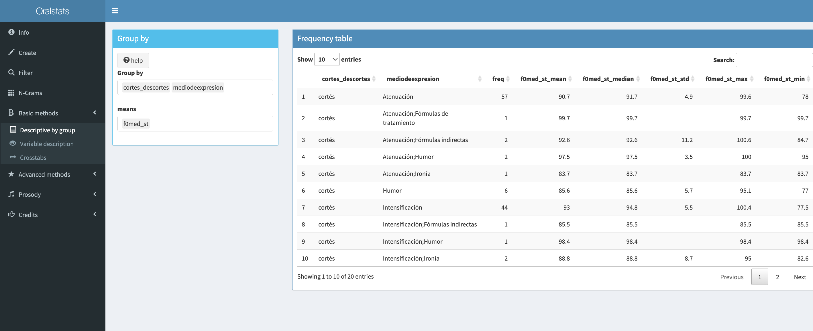
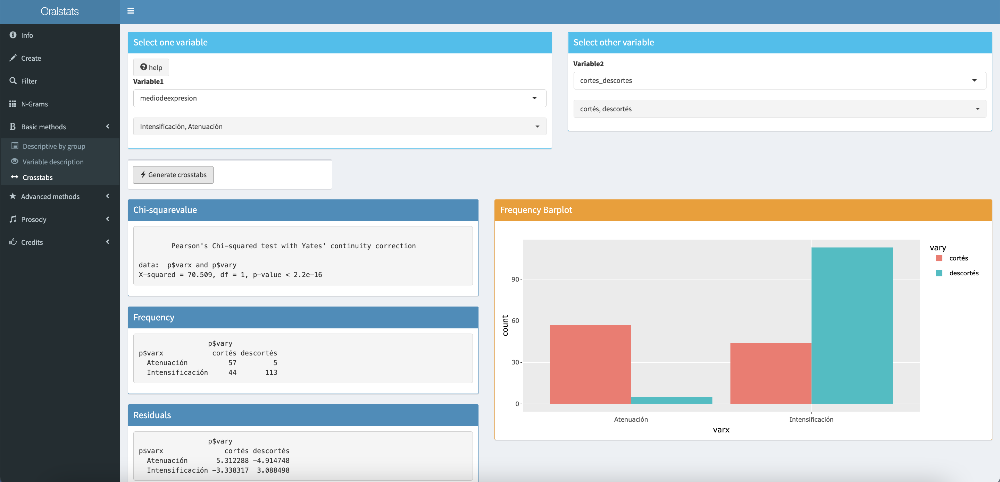

 

"Get to the chopper!" (Major Alan "Dutch" Schaefer character, Predator movie [1987])

🔴**New version**🔴 (30/06/2022)! Version 1.3 (beta). 

With this new version, it is possible to create and export files directly in the same Shiny environtment. 

# Description

Oralstats is a data exploratory tool developed to achieve two main
operations at discourse level analysis: 1) modify and transform
transcribed speech data and join this data with intensity or pitch
values; and 2) visualize and explore this data with several statistical
and visualization methods (decision trees, heatmaps, boxplots, and so
on). This tool was developed by Adrián Cabedo Nebot
([adrian.cabedo\@uv.es](adrian.cabedo@uv.es)), associate professor at
Universitat de València (Spain), and it was presented in 2019 as a
scientific project to get the position currently held.

# Brief introduction video

You can check it here: https://youtu.be/SoELWc8N3zI

# How to cite

You can use the following citation in order to refer this tool:

- Cabedo, A. (2021). Oralstats. A tool to visualize and explore
transcriptions and phonic data. Version beta 1.0 <https://github.com/acabedo/oralstats>

- Cabedo, A. (2022). Oralstats. A tool to visualize and explore
transcriptions and phonic data. Version beta 1.3 <https://github.com/acabedo/oralstats>

- Cabedo Nebot, A. (2022). Using Oralstats for prosodic characterisation of speakers in different discourse genres. Loquens, 8(1-2), e079. <https://doi.org/10.3989/loquens.2021.079>

- Cabedo Nebot, A. (2022). Visualizing melody with multiple acoustic and tagging values using the visualization module of the Oralstats tool. Estudios de Fonética Experimental, XXXI, 135-148. <https://www.ub.edu/journalofexperimentalphonetics/pdf-articles/XXXI-10-Cabedo.pdf>

# Docs

The docs section is **still under development**. For now, if you have
some problem or question about Oralstats, you can send me an email
([adrian.cabedo\@uv.es](adrian.cabedo@uv.es)). Although the viewing
module (developed with Shiny) is pretty straightforward, the creation
module, as it is highly customizable, it could be a little overwhelming at the beginning.

# Demo

You can see an available demo for last version (1.3) at this [link](https://adrin-cabedo.shinyapps.io/oralstats_v_1_3/). Also, you can check other versions  for oralstats.view at this [link](https://adrin-cabedo.shinyapps.io/padrezorro/)(old version, version 1.1) or at [link](https://adrin-cabedo.shinyapps.io/fonocortesia2/) (version 1.2). These demos allow the exploration of intonational phrases for two of the mods explained below: first one, *Padre Zorro among genres*; second one, *Fonocortesia*

# Funding

Although the Spanish Ministry of Science and Innovation and the
Conselleria de Innovación, Universidades, Ciencia y Sociedad Digital
didn't support this project directly, I received the love of some
colleagues with funded projects. This love has been materialized in form
of a couple of computers and the payment of another couple of
conferences fees (and trips). I am very grateful for that. I want to
cite these funded projects that have supported me in the previously
mentioned way:

1.  Project: "La atenuación pragmática en su variación genérica: géneros
    discursivos escritos y orales en el español de España y América"
    (MICINN, FFI2016-75249-P). Directoras: Marta Albelda / Maria
    Estellés (Departamento de Filología Española, UV). 2016-2021

2.  Project: "Unidades discursivas para una descripción sistemática de
    los marcadores del discurso en español" (UDEMADIS, FFI2016-77841-PP
    -MICINN). Director: Salvador Pons Bordería (Departamento de
    Filología Española, UV). 2016-2021

3.  Project: ESPRINT. Estrategias pragmático-retóricas en la interacción
    conversacional conflictiva entre íntimos y conocidos:
    intensificación, atenuación y gestión interaccional. Ministerio de
    Ciencia e Innovación. MICINN (PID2020-114895GB-10). 2021-

# Requirements

Oralstats is a tool developed to be used mainly on an offline
environment, but you can also use the aid of Shiny at its full potential
to get Oralstats online. In that sense, we use an online demo for
illustrative purposes.

## R versions

Required: R version 3.6.0 or later

Required: A modern browser (e.g., Chrome or Safari). Internet Explorer
(version 11 or higher) should work as well

Required: Rstudio 1.4.1717 or later

## R packages

### For oralstats.view

DBI; RSQLite; shinybusy; psych; shiny; RColorBrewer; tidyverse;
shinyWidgets; tidytext; readr; heatmaply; RLumShiny; shinybusy; party; gplots; plot;Factominer

### For oralstats.creation

tidyverse; sqldf; udpipe; xfun; readbulk; readxl

**Note:** UDPipe will need a specific file to deal with the language
used on data. By default, we are using Spanish file, but you can use any
other language file covering your needs.

# Viewing

With oralstats.view you can choose from a huge variety of statistical
methods (decision trees, discriminant analysis, ANOVAs) but also from
several visualization procedures (pie charts, frequency tables, timeline
charts...). See the following figures to take a look to some of these
features:

Figure 1. Welcome page.

Figure 2. Basic creation page (not all functions available).

Figure 3. Filter.

Figure 4. Description by group.

Figure 5. Variables descriptive statistics.

Figure 6. Chisquare

Figure 7. Correlation plot

Figure 8. Decision tree plot (using Rpart and Party libraries)

Figure 9. Heatmap

Figure 10. ANOVA and boxplots

Figure 11. PCA and Cluster analysis

Figure 12. N-grams

Figure 13. Pitch or intensity visualization and audio 

Figure 14. Linear prosodic behaviour among file or corpus

Figure 15. Pitch contour with TOBI tagging

# Notes on some tonal and semantic transformations

Some categorization procedures are still being improved. So, although
they are consistent among all the files you can process, you should pay
attention to these variables and their corresponding variants:

1.  **TOBI** (Tone and Break Indices, Pierrehumbert 1993 and Estebas &
    Prieto 2008). We calculated some tones categories related to the
    tonic vowels of the utterances, but this procedure is a little basic
    considered with other computational solutions available out there.
    If you are interested in better TOBI transformations for Spanish,
    you should check the work done by Wendy Elvira in EtiTOBI
    (Elvira-García et alii 2016):
    <https://github.com/wendyelviragarcia/eti_ToBI>

2.  **SMA/AMH** (Speech melodic analysis/análisis melódico del habla,
    Cantero & font 2012). This is a porcentual codification of the pitch
    rises and falls. Specific improvements, adding intensity and
    duration codifications, can be followed in references like Cantero
    (2019).

3.  **Sentiment analysis**. The words transformation part of the script
    will add sentiment analysis based on a simple correlation with an
    annotated list of words and corresponding sentiments. This is a very
    basic annotation done with a joining Tidyverse approach;
    nevertheless, it not computes strong sentiments assignations as well
    as it is done in other R packages, like Syuzhet
    (<https://github.com/mjockers/syuzhet>), or in other Python
    solutions (Taboada et alii 2011,
    [\<https://github.com/sfu-discourse-lab/SO-CAL\>](https://github.com/sfu-discourse-lab/SO-CAL){.uri}).

    **Note:** We used sentiment analysis and the explained Tidyverse
    approach to support partially the PHD thesis of [Danny
    Murillo](https://www.researchgate.net/profile/Danny-Murillo-Lanza)
    (in elaboration), but you could use any other tagging process. The
    process only needs having a list of words or expressions and its
    meaning, being this a sentiment or another conceptual factor, as
    politeness, humor, mitigation or whatever element that could be
    interesting for a researcher.

# Mods

As scientific interests can differ substantially from one researcher to
another, there are different projects where Oralstats is directly
involved. The ones below are just some of them, but the point is that
they can be incremented as well as Oralstats is also being improved. All
these projects, with the exception of the *Discourse genre and
idiolectal analysis from politicians* and the analysis of the youtuber
Pico de Oro/Padre Zorro*,* are still being developed.

1.  *Sahelanthropus*. This modification was developed to help
    researchers to characterize the speech of specific individuals. More
    specifically, the main idea is to compare the speech features of one
    person with other individuals to see in what sense this features are
    really shared with a speaker community or if they are idiosyncratic
    of this individual. So, basically, it compares the speech of one
    individual with the average speech coming from a global corpus.

2.  *Ozymandias*. A modification developed to deal with linked
    linguistic data. The aim is to analyze different discourse units
    (words, intonational phrases, subacts, speech acts) defined at the
    Val.Es.Co. speech units framework (Pons [ed.] 2014 and
    <http://www.valesco.es>).

3.  *Discourse genre and idiolectal analysis from politicians.* This is
    a small sample of 4 different Spanish politicians speaking along
    multiple oral discourse genres. You can see a demo here:
    [https://adrin-cabedo.shinyapps.io/oralstatsgenres](https://adrin-cabedo.shinyapps.io/oralstatsgenres/?_ga=2.267120075.498562318.1634906108-483580461.1634906108)

4.  *Padre zorro among genres*. This version includes intonational
    phrases, words and phonemes recorded from an Spanish youtuber called
    Padre Zorro/Pico de oro. Data proceed from three different online
    formats: Twitch monologue, Youtube edited monologue and a Youtube
    polemic interview. You can check the demo here:
    <https://adrin-cabedo.shinyapps.io/padrezorro/>

5.  *Fonocortesía*. This was a funded project ended in 2013 and
    supervised by full professor Antonio Hidalgo Navarro.
    You can access this data dynamically at
    [\<http://fonocortesia.es\>](http://fonocortesia.es) and also
    <https://adrin-cabedo.shinyapps.io/fonocortesia/> (old Oralstats version) or <https://adrin-cabedo.shinyapps.io/fonocortesia2/> (new Oralstats version [recommended])

6.  *Aroca* (in collaboration with Andrea Carcelén Guerrero). This is a special version and simplification from Oralstats core package: adrin-cabedo.shinyapps.io/aroca_viewer/ Nowadays, it includes moren than 150 Spanish conversations from Ameresco corpus, covering 14 Latinoamerican cities <www.corpusameresco.com>. The specific page for this mod can be found at: https://github.com/acabedo/aroca

# Credits

I must give an special credit to *Radiant, Business analytics using R
and Shiny* (Vnijs 2016). Although it is focused mainly on Business data
mining, this tool was for me a deeply inspirational idea: in my case, it
developed the idea of analyzing data online/offline, using Shiny, in a
dynamic mode, adding and/or filtering this data to observe linguistic
patterns from speech transcriptions.

Other inspiration for me was all the work done by Davies the last twenty
years (2005, 2016, 2020, among many others) on the construction of
several linguistic corpora; specially, I got really interested about
joining data with SQL instances. This is really a good approach to
structured data, as it could be the one coming from oral linguistic
data, in which phonemes relate to words and these last two relate to
utterances and all of them relate to speakers and so on.

Finally, about the ideas that have been key to develop Oralstats, I want
to express my gratitude to web platforms like Spokes
(<http://pelcra.clarin-pl.eu/SpokesBNC/>) and to software tools like the
ones developed by Laurence Anthony (<https://www.laurenceanthony.net/>).
Also, it wouldn't have been possible to make speech and phonic analysis
without the aid of tools like ELAN (<https://archive.mpi.nl/tla/elan>)
and PRAAT (Boersma and Weenink, 2021,
<https://www.fon.hum.uva.nl/praat/>).

# Caution

All errors and omissions (bad statistical operations [means,
medians...], bad visualizations, etc.) remain the author's sole
responsibility.

# License

GNU General Public License v3.0 Permissions of this strong copyleft
license are conditioned on making available complete source code of
licensed works and modifications, which include larger works using a
licensed work, under the same license. Copyright and license notices
must be preserved. Contributors provide an express grant of patent
rights.
